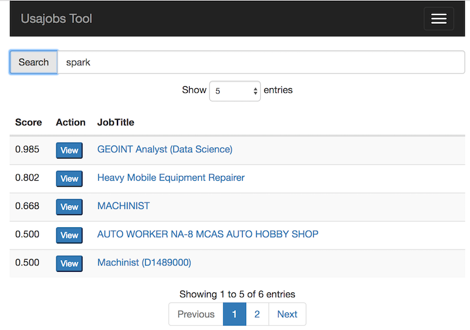

# Usajobs Search Tool

A web app for searching usajobs.gov

# Quick Start

I have deployed the Flask version of this app to heroku--try it [here](https://usajobtool.herokuapp.com/).  (Note: I'm using a free heroku account, so the page could be sluggish.)

# Background

As recently as 2015, the [usajobs.gov](https://www.usajobs.gov) website
was not mobile friendly--it was painful to use on mobile devices, 
and job search results were often not 
that great--searches for 'mathematician' would include results for 
bartenders and waiters (who need 'math' skills), and 'spark' (the data science
tool) would return results for auto mechanics (who change 'spark' plugs).

To improve user experiences, in 2015 I made version 1 of this tool--a cross-platform, 
mobile-friendly web app for searching usajobs.gov. 
The app allowed users to search for jobs using the usagovs.gov open 
[REST API](https://developer.usajobs.gov/General), and it styled results using 
Bootstrap so they looked great on phones, tablets, and PCs. 
As an added feature, the app included a configurable online machine learning
algorithm to learn user preferences and show the most interesting jobs first.

To enhance user privacy, version 1 of this app ran entirely in the user browser using 
javascript and HTML5.  

In October 2015, version 5.2 of the usajobs.gov API broke this app and 
made it impossible to query the API from javascript in browsers.
(The new API requires you rewrite the HTTP headers, but 
browsers prevent javascript from doing this.)

Hence, I have released version 2 of the tool.  In the release, 
I developed three ways to rewrite the HTTP headers: 

1. I built a browser extension.  You can find it in the folder *1_WebExtension/*.
2. I built a back end in Flask that can be used to host the website.
  The Flask backend takes care of changing the HTTP headers.  See *2_Flask/*.
3. I used Apache Cordova to port the web app to a native Android app.
  See *3_MobileApp/*.

All three versions of the tool look the same to the user.

## Screenshot:

